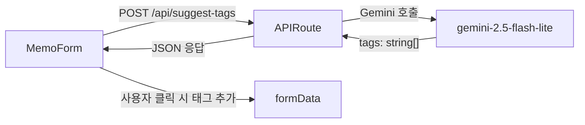

# AI 태그 자동 추천 기능 추가 계획

## 아키텍처 흐름



## 변경 파일 목록

### 신규 생성

- **`src/app/api/suggest-tags/route.ts`** — 태그 추천 API Route
- **`src/hooks/useSuggestTags.ts`** — 태그 추천 상태 관리 커스텀 훅

### 수정

- **[`src/components/MemoForm.tsx`](src/components/MemoForm.tsx)** — 태그 영역에 "AI 태그 추천" 버튼 및 추천 태그 칩 UI 추가

## 구현 상세

### 1. `src/app/api/suggest-tags/route.ts`

기존 [`src/app/api/summarize/route.ts`](src/app/api/summarize/route.ts)와 동일 패턴으로:
- `POST` 메서드, `{ title, content }` 수신
- Gemini에게 JSON 배열 형식(`["태그1", "태그2", ...]`)으로 5~8개 태그 반환 요청
- `{ tags: string[] }` 또는 `{ error: string }` 반환
- 프롬프트: 제목·내용 기반으로 핵심 키워드 태그 추출, 한국어/영어 혼용 허용, 단어 단위 짧은 태그

### 2. `src/hooks/useSuggestTags.ts`

```typescript
export const useSuggestTags = () => {
  // 상태: suggestedTags, isLoading, error
  // suggestTags(title, content): POST /api/suggest-tags 호출
  // reset(): 상태 초기화
}
```

### 3. `src/components/MemoForm.tsx` 변경

태그 영역(`/* 태그 */` 블록, 200번째 줄 부근) 내에 추가:

**"AI 태그 추천" 버튼** — 태그 레이블 오른쪽에 배치, 로딩 중 스피너 표시

```
태그                     [AI 태그 추천 버튼]
[ 태그 입력 input        ] [추가]
```

**추천 태그 칩 목록** — 버튼 클릭 후 아래에 표시

```
추천 태그:  #React  #NextJS  #TypeScript  ...
           (클릭 시 formData.tags에 추가, 이미 추가된 태그는 비활성화)
```

**에러 메시지** — 실패 시 붉은 텍스트로 표시

## UX 상세

- 추천 태그는 클릭 1회로 formData에 즉시 반영 (기존 수동 태그 삭제 없음)
- 이미 추가된 태그는 체크 표시와 함께 비활성화(클릭 불가)
- 제목 또는 내용이 비어 있을 경우 버튼 비활성화 + 툴팁 안내
- 폼이 닫히거나 editingMemo가 바뀌면 추천 결과 자동 초기화

## 주의 사항

- `stripMarkdown` 유틸을 `src/utils/` 로 이동해 두 훅에서 공유 (중복 제거)
- API 키 검증은 기존 `/api/summarize/route.ts`와 동일 방식
