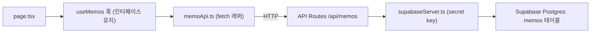

# Supabase 메모 데이터 마이그레이션 계획

## 목표 / 제약
- LocalStorage(`memo-app-memos`)에 저장되던 `Memo[]`를 Supabase Postgres로 이전한다.
- 기존 타입 [`src/types/memo.ts`](src/types/memo.ts)의 `Memo`, `MemoFormData`는 **변경 없이 유지**한다.
- 요약(summary)은 현재처럼 DB에 저장하지 않고 임시 UI 상태로 유지한다 (`useSummarize` 그대로).
- 인증 없이 단일 사용자로 사용하고, 클라이언트가 아닌 **Next.js API Route(서버)** 에서 secret key로 Supabase에 접근한다 (키 노출 없음, 기존 AI API Route 패턴과 일관).

## 아키텍처

데이터 흐름 핵심: DB는 snake_case(`created_at`), 앱 타입은 camelCase(`createdAt`)이므로 API Route 계층에서 **row <-> Memo 매핑**을 수행해 인터페이스를 그대로 보존한다.

## 1. DB 스키마 (Supabase MCP `apply_migration`)
`public.memos` 테이블 생성 (현재 빈 프로젝트):
- `id uuid primary key` — 기존 클라이언트의 `uuidv4()` 생성 패턴 유지 (insert 시 id 전달)
- `title text not null`
- `content text not null default ''`
- `category text not null`
- `tags text[] not null default '{}'`
- `created_at timestamptz not null default now()`
- `updated_at timestamptz not null default now()`
- `created_at desc` 인덱스 (정렬용)
- **RLS 활성화 + 정책 없음**: anon/publishable key 접근 차단, 서버 secret key(service role)는 RLS 우회. 
- (선택) [`src/utils/seedData.ts`](src/utils/seedData.ts)의 `sampleMemos` 6건을 마이그레이션에서 `INSERT`해 초기 데이터 시딩.

## 2. 환경 변수 / 의존성
- `npm install @supabase/supabase-js`
- [`.env.local`](.env.local)에 추가 (서버 전용, `NEXT_PUBLIC_` 접두사 없음):
  - `SUPABASE_URL=https://jwlxmnovhmwlkdlvmceg.supabase.co`
  - `SUPABASE_SECRET_KEY=<secret key>` — 사용자가 Supabase 대시보드에서 발급/입력 필요

## 3. 서버 Supabase 클라이언트 + 매퍼 (신규)
`src/utils/supabaseServer.ts`:
- `createClient(SUPABASE_URL, SUPABASE_SECRET_KEY)` 싱글톤 (`auth: { persistSession: false }`)
- `rowToMemo(row)` / `memoToRow(memo)` 매핑 함수 (snake_case <-> camelCase). `Memo` 타입 그대로 반환.

## 4. API Routes (신규, 서버)
- `src/app/api/memos/route.ts`
  - `GET`: 전체 메모 `created_at desc` 조회 -> `Memo[]`
  - `POST`: body(`Memo`) insert -> 생성된 `Memo`
- `src/app/api/memos/[id]/route.ts`
  - `PATCH`: id로 update (updatedAt 갱신) -> `Memo`
  - `DELETE`: id로 삭제
- 모든 응답은 매퍼를 통해 `Memo` 형태(JSON)로 반환.

## 5. 클라이언트 데이터 계층 교체
`src/utils/memoApi.ts` (신규, `localStorageUtils` 대체): `getMemos()`, `addMemo(memo)`, `updateMemo(memo)`, `deleteMemo(id)` — 위 API Route를 `fetch`로 호출, `Memo`/`Memo[]` 반환.

[`src/hooks/useMemos.ts`](src/hooks/useMemos.ts) 리팩터링 (**반환 인터페이스 동일 유지**):
- 초기 `useEffect`: `seedSampleData()` 제거 -> `GET /api/memos`로 로드.
- `createMemo`: `uuidv4()`로 id 생성 후 낙관적 `setMemos` + `POST` 호출.
- `updateMemo`: 낙관적 갱신 + `PATCH`.
- `deleteMemo`: 낙관적 제거 + `DELETE`.
- `searchMemos`/`filterByCategory`/`stats`/`filteredMemos`는 그대로 (클라이언트 필터 유지).
- `localStorageUtils`, `seedData` import 제거. 반환 객체의 키/시그니처는 그대로라 [`src/app/page.tsx`](src/app/page.tsx)는 거의 수정 불필요(현재도 반환값을 동기 사용하지 않음).

## 6. 정리
- [`src/utils/localStorage.ts`](src/utils/localStorage.ts), [`src/utils/seedData.ts`](src/utils/seedData.ts)는 더 이상 사용하지 않으므로 제거(시딩을 마이그레이션으로 옮긴 경우).
- 빌드/린트 확인: `npm run build`, `npm run lint`.

## 검증
- 개발 서버에서 메모 생성/수정/삭제/검색/카테고리 필터 동작 확인.
- Supabase MCP `list_tables`로 `memos` 테이블 및 데이터 반영 확인.
